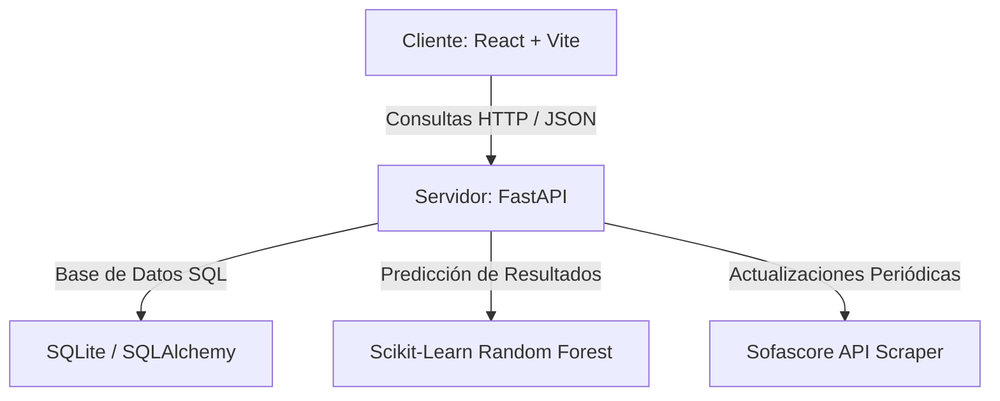

# 📊 Trainylics: Plataforma Avanzada de Análisis y Tácticas de Fútbol

¡Bienvenido a **Trainylics**! Una aplicación integral diseñada para directores técnicos, analistas tácticos y scouters de fútbol. La plataforma combina la sincronización de partidos en tiempo real de Sofascore, la generación de pizarras tácticas interactivas y un motor de Inteligencia Artificial que predice resultados y recomienda formaciones personalizadas según el rival.

---

## 🗺️ Centro de Documentación (Guías Rápidas)

Para facilitar la navegación del proyecto en GitHub, toda la documentación detallada se encuentra categorizada e indexada a continuación:

*   🚀 **[STARTUP.md](STARTUP.md)**: Guía paso a paso para levantar los entornos locales (React + FastAPI) y configuraciones mediante Docker Compose.
*   📊 **[cobertura_estadisticas.md](cobertura_estadisticas.md)**: Análisis minucioso de la cobertura estadística disponible por liga y año en Chile.
*   ⚠️ **[ligas_solo_resultados.md](ligas_solo_resultados.md)**: Simbología y listado de ligas con cobertura básica de marcadores sin estadísticas avanzadas.
*   ⚙️ **[commands.md](commands.md)**: Guía de comandos de sincronización Sofascore, migración de base de datos y scripts de mantenimiento.
*   🎨 **[design_system.md](design_system.md)**: Especificaciones de diseño visual, clases CSS personalizadas, y paletas de colores del tema oscuro.
*   📁 **[requirements_and_design.md](requirements_and_design.md)**: Requisitos del sistema, historias de usuario, diagramas de bases de datos y diccionario de datos.
*   🗃️ **[database_design_mer_mr.md](database_design_mer_mr.md)**: Explicación académica y diagramación del Modelo Entidad-Relación (MER) y Modelo Relacional (MR) de la base de datos.
*   🤖 **[machine_learning_history.md](machine_learning_history.md)**: Historial del entrenamiento de IA, matrices de confusión, precisión F1-score e importancia de variables del modelo.

---

## ✨ Características Principales

*   **Pizarra Táctica Interactiva:** Dibuja formaciones de juego, arrastra fichas de jugadores del club y cambia el esquema dinámicamente.
*   **Asistente Táctico de IA (Próximo Rival):** Al seleccionar tu equipo en la pizarra táctica o en el Home, la IA analiza el historial del rival más cercano, predice el resultado y te sugiere una formación ideal con un solo clic para contrarrestar sus puntos fuertes.
*   **Sincronización en Vivo:** Conectado directamente a la API de Sofascore para descargar fechas de juego, alineaciones, tiros a puerta, posesión y xG de ligas profesionales e intermedias (Primera División, Ascenso, Segunda y Tercera División A/B).
*   **Gestión de Clubes y Plantillas:** Fichas de rendimiento promedio, historial de forma del equipo (W-D-L), notas del scouter y visualización de atributos de jugadores mediante gráficos de radar.
*   **Panel de Administración:** Control total sobre los usuarios de la plataforma, creación de credenciales aleatorias seguras y asignación de directores técnicos a clubes específicos.

---

## 🛠️ Arquitectura de Software

El sistema utiliza un stack moderno y eficiente diseñado para la escalabilidad:



---

## 🚀 Inicio Rápido con Docker

La forma más rápida de arrancar todo el sistema (Frontend, Backend, Base de Datos e IA) es mediante contenedores Docker:

### 1. Requisitos Previos
*   Instalar [Docker Desktop](https://www.docker.com/products/docker-desktop).
*   Contar con un archivo `.env` en la raíz del proyecto configurado.

### 2. Levantar la Aplicación
Abre una terminal en el directorio raíz del proyecto y ejecuta:

```bash
docker-compose up --build -d
```

### 3. Puertos de Acceso
Una vez levantado el servicio:
*   **Frontend (Aplicación Web):** [http://localhost:5173](http://localhost:5173)
*   **Backend (Documentación Swagger):** [http://localhost:8000/docs](http://localhost:8000/docs)