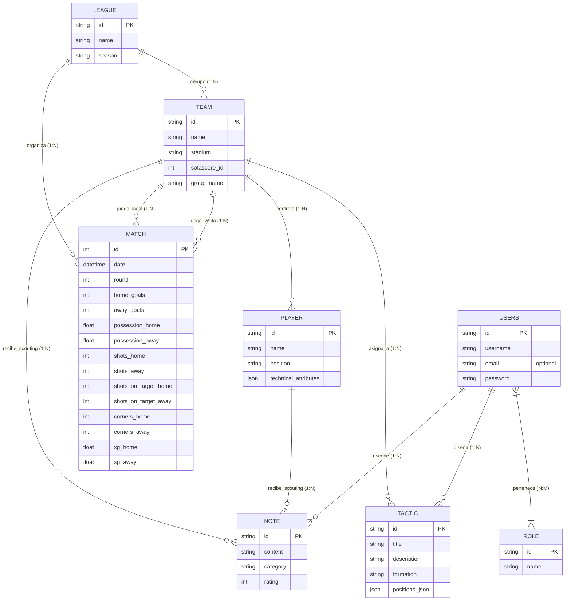

# Diseño de Base de Datos: Modelo Entidad-Relación (MER) y Modelo Relacional (MR)

Este documento detalla el diseño conceptual y lógico de la base de datos de **Trainylics**, explicando las diferencias fundamentales entre el Modelo Entidad-Relación (MER) y el Modelo Relacional (MR), las reglas de transformación y su aplicación práctica en el sistema de gestión táctica y scouting.

---

## 1. Diferencias Fundamentales: MER vs. MR

| Característica | Modelo Entidad-Relación (MER) | Modelo Relacional (MR) |
| :--- | :--- | :--- |
| **Nivel de Abstracción** | **Conceptual** (Independiente del motor de BD). | **Lógico / Físico** (Orientado a la implementación). |
| **Elemento Central** | **Entidades** (objetos del negocio) y **Relaciones** (vínculos). | **Tablas** (relaciones matemáticas), columnas y llaves. |
| **Llaves Foráneas (FK)** | **No se representan explícitamente**. Las asociaciones son semánticas. | **Obligatorias**. Se usan para declarar la integridad referencial. |
| **Atributos Multivalor** | Permitidos (representados con elipse doble). | Prohibidos. Deben normalizarse en tablas hijas (1:N). |
| **Objetivo** | Entender el modelo de negocio y definir los requerimientos. | Definir la estructura exacta que implementará el motor de BD (PostgreSQL/SQLite). |

---

## 2. Modelo Entidad-Relación (MER) - Diseño Conceptual

El MER modela el dominio del fútbol y el scouting a través de **Entidades** (sustantivos), **Atributos** (propiedades) y **Relaciones** (verbos).

### Simbología Estándar del MER:
*   **Entidad Fuerte (Rectángulo):** Objeto con existencia independiente (ej. `TEAM`, `LEAGUE`).
*   **Entidad Débil (Doble Rectángulo):** Depende de otra entidad para existir (ej. `NOTE` o `PLAYER` si no existieran los clubes).
*   **Relación (Rombo):** Conexión entre dos o más entidades (ej. *agrupa*, *juega*, *diseña*).
*   **Atributo (Elipse/Óvalo):** Propiedades de la entidad.
*   **Atributo Clave (Elipse con texto subrayado):** Identificador único o Clave Primaria (PK).
*   **Cardinalidad (1:1, 1:N, N:M):** Límites de participación en la relación.

### Diagrama MER Conceptual (Mermaid):

---

## 3. Reglas de Transformación (MER a MR)

Para convertir el diagrama conceptual anterior en un esquema lógico relacional ejecutable, se aplicaron las siguientes cuatro reglas:

1.  **Entidad a Tabla:** Cada entidad fuerte (`TEAM`, `PLAYER`, `MATCH`, etc.) se transforma en una tabla física. Los atributos se convierten en columnas de la tabla.
2.  **Relaciones 1:N (Uno a Muchos):** Se propaga la Clave Primaria (PK) del lado "1" al lado "N" como una Clave Foránea (FK).
    *   *Ejemplo:* Un equipo (`TEAM`) pertenece a una única liga (`LEAGUE`). Por lo tanto, añadimos `league_id` como FK en la tabla `team`.
3.  **Relaciones N:M (Muchos a Muchos):** Se crea una tabla intermedia (de unión) cuyas PK compuestas son las PK de ambas entidades.
    *   *Ejemplo:* Un usuario (`USERS`) puede tener varios roles (`ROLE`), y un rol puede pertenecer a varios usuarios. Se crea la tabla intermedia `user_role` con `user_id` y `role_id` como llaves foráneas.
4.  **Atributos Multivaluados:** No se permiten colecciones en celdas individuales en la primera forma normal (1FN). Se transforman en tablas 1:N o se serializan (en Trainylics se optó por guardar las coordenadas tácticas y atributos técnicos en formato estructurado **JSON/TEXT** para optimizar la velocidad de lectura).

---

## 4. Modelo Relacional (MR) - Diseño Lógico y Físico

El Modelo Relacional se expresa mediante la declaración formal de tablas, tipos de datos, restricciones y relaciones.

### Notación Escrita del Esquema Relacional:
Las claves primarias se marcan en **negrita y subrayado**, y las claves foráneas llevan el sufijo `_FK`.

*   **`LEAGUE`** ( $\underline{\mathbf{id}}$, name, season, created_at, modified_at )
*   **`TEAM`** ( $\underline{\mathbf{id}}$, name, stadium, sofascore_id, group_name, *league_id_FK*, created_at, modified_at )
*   **`PLAYER`** ( $\underline{\mathbf{id}}$, name, position, technical_attributes, *team_id_FK*, created_at, modified_at )
*   **`MATCH`** ( $\underline{\mathbf{id}}$, date, round, home_goals, away_goals, possession_home, possession_away, shots_home, shots_away, shots_on_target_home, shots_on_target_away, corners_home, corners_away, xg_home, xg_away, *league_id_FK*, *home_team_id_FK*, *away_team_id_FK*, created_at, modified_at )
*   **`TACTIC`** ( $\underline{\mathbf{id}}$, title, description, formation, positions_json, *team_id_FK*, *author_id_FK*, created_at, modified_at )
*   **`NOTE`** ( $\underline{\mathbf{id}}$, content, role, category, rating, *user_id_FK*, *team_id_FK*, *player_id_FK*, created_at, modified_at )
*   **`USERS`** ( $\underline{\mathbf{id}}$, username, email_optional, password, person_id, created_at, modified_at )
*   **`ROLE`** ( $\underline{\mathbf{id}}$, name, created_at, modified_at )
*   **`USER_ROLE`** ( $\underline{\mathbf{user\_id\_FK}}$, $\underline{\mathbf{role\_id\_FK}}$ )

---

## 5. Integración con la Inteligencia Artificial (IA)

En la base de datos relacional, el modelo predictivo de IA y las formaciones interactúan de la siguiente forma:

1.  **Entrada de Datos (Features):** La IA consulta la tabla `MATCH` filtrando por el `league_id_FK` y recuperando promedios de tiros (`shots`), posesión (`possession`) y goles esperados (`xg`) de los últimos 5 encuentros jugados por los equipos correspondientes.
2.  **Predicción de Alineación:** El algoritmo de asignación recupera los registros de la tabla `PLAYER` relacionados con el `team_id` del rival para calcular la disponibilidad según el histórico de lesiones, clasificándolos en *Titulares*, *Suplentes*, *Sancionados* o *Lesionados*, y los devuelve al módulo táctico.
3.  **Persistencia del Plan:** La pizarra táctica en el frontend permite colocar los nodos asignando los IDs de la tabla `PLAYER` de ambos equipos involucrados en la fecha, guardando el resultado de la pizarra en el campo `positions_json` de la tabla `TACTIC` para su posterior carga y despliegue por parte del director técnico.
