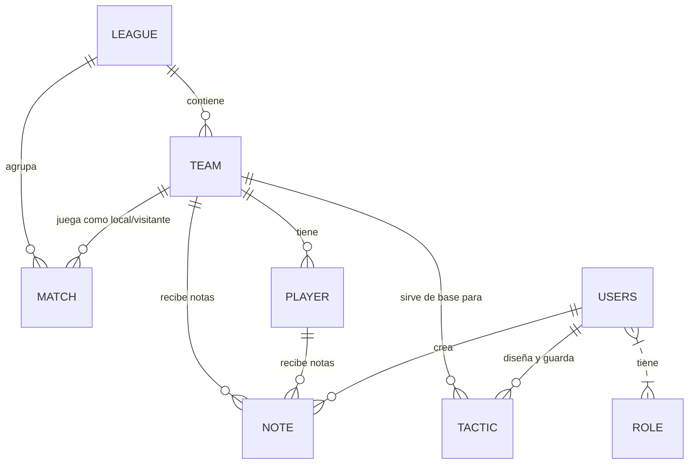

# Requerimientos y Diseño Arquitectónico - Trainylics

Este documento detalla la viabilidad de datos, los requerimientos de la plataforma, la estructura del proyecto y los modelos relacionales (MER / MR) basados en la base de datos PostgreSQL actual.

---

## 1. Viabilidad de Datos para Nuevos Módulos

Al analizar el esquema físico actual de la base de datos PostgreSQL, determinamos la viabilidad técnica para los módulos sugeridos:

| Módulo Propuesto | ¿Datos Presentes en DB? | Detalle / Viabilidad |
| :--- | :---: | :--- |
| **Tabla de Posiciones Dinámica** | **SÍ** | Totalmente viable. Contamos con las columnas `home_team_id`, `away_team_id`, `home_goals` y `away_goals` en la tabla `match` para calcular puntos, partidos ganados/empatados/perdidos y diferencia de goles al vuelo. |
| **Predicciones 2026 (Futuros)** | **SÍ** | Totalmente viable. Ya existen los partidos correspondientes a 2026 cargados con goles en `NULL`. La API y el servicio de Machine Learning (`ml_service.py`) pueden procesar y predecir los resultados de estos partidos usando el historial previo (2022-2025). |
| **Clubes y Plantillas por Año** | **SÍ** | Viable. Las tablas `team` y `player` están vinculadas. `player` cuenta con la columna `position` para su ubicación táctica y `technical_attributes` (formato JSON) donde se pueden almacenar métricas individuales. |
| **Pizarra Táctica ("Cancha")** | **SÍ** | Viable. Los jugadores están asociados a sus equipos correspondientes, permitiendo listarlos por demarcación (`position`) en la pizarra del entrenador y persistir las formaciones en la nueva tabla `tactic`. |
| **Mapas de Calor** | **PARCIAL** | **Limitación Actual:** No existen tablas de eventos o coordenadas individuales en el esquema actual. <br>_Solución propuesta:_ Se pueden simular zonas de calor basándonos en la posición principal del jugador (`position`) y sus atributos, o ampliar el scraper de Sofascore en una etapa futura para almacenar coordenadas $(X,Y)$ de jugadas. |

---

## 2. Requerimientos Funcionales y No Funcionales

### Requerimientos Funcionales (RF)
*   **RF-01 (Selectores de Partidos):** El sistema debe permitir al usuario filtrar los resultados y partidos por Liga, Año (Temporada) y Jornada de manera independiente.
*   **RF-02 (Tabla de Posiciones):** El sistema debe calcular y mostrar la tabla de posiciones dinámicamente según la liga y la temporada seleccionadas.
*   **RF-03 (Predicciones IA):** El sistema debe mostrar predicciones tácticas automatizadas para los próximos encuentros de la temporada 2026.
*   **RF-04 (Plantilla Histórica):** El usuario debe poder ver la lista de jugadores de cada club agrupados por su posición táctica según el año elegido.
*   **RF-05 (Visualización de Resultados):** Las tarjetas de resultados deben destacar tipográficamente al equipo ganador (negritas y badge de color verde) y formatear estéticamente los empates.
*   **RF-06 (Gestión de Notas de Scouting):** El scouter debe poder crear, categorizar (táctico, técnico, físico, mental) y puntuar con estrellas a equipos y jugadores.
*   **RF-07 (Navegación Unificada):** El sistema debe contar con un componente `Layout` global que envuelva todas las vistas autenticadas, ofreciendo un menú de navegación lateral (sidebar) en escritorio y un dropdown colapsable en dispositivos móviles.
*   **RF-08 (Validación Automática de Sesión):** Al renderizar el layout, el frontend debe validar el token de sesión con el endpoint `/auth/me`. En caso de token inválido o expirado, debe limpiar las credenciales locales y redirigir al usuario al login (`/`).
*   **RF-09 (Pizarra Táctica 2D):** El sistema debe proporcionar una cancha interactiva donde el entrenador visualice los 11 jugadores según formaciones base predefinidas (`4-3-3`, `4-4-2`, `3-5-2`, `4-2-3-1`, `5-3-2`).
*   **RF-10 (Edición de Fichas en Pizarra):** El entrenador debe poder arrastrar las fichas de los jugadores para reposicionarlos libremente en el campo de juego, asignarles jugadores específicos del club seleccionado y escribir instrucciones estratégicas personalizadas.
*   **RF-11 (Persistencia de Tácticas):** El sistema debe permitir crear, actualizar (guardar cambios) y eliminar esquemas tácticos directamente desde la interfaz, persistiendo el título, descripción, formación y las posiciones en formato JSON.

### Requerimientos No Funcionales (RNF)
*   **RNF-01 (Rendimiento):** Las consultas de cálculo de posiciones dinámicas deben responder en menos de 500ms mediante el indexado correcto de llaves foráneas.
*   **RNF-02 (Estética y UX):** La interfaz debe seguir un diseño oscuro moderno con tipografías legibles (e.g. Outfit/Inter), transiciones suaves e indicadores cromáticos fluidos para ganadores, perdedores y empates.
*   **RNF-03 (Portabilidad):** Todo el entorno de desarrollo y producción debe desplegarse de manera portable utilizando Docker y Docker Compose.
*   **RNF-04 (Concurrencia):** El backend debe soportar peticiones asíncronas concurrentes utilizando la arquitectura `FastAPI` y controladores `async/await` de SQLAlchemy/SQLModel.
*   **RNF-05 (Interactividad en Tiempo Real):** El arrastre de las fichas tácticas y la reordenación de la cancha interactiva debe ejecutarse sin retardo de renderizado (60 FPS) mediante manipulación directa de eventos de ratón en el DOM.

---

## 3. Casos de Uso (Scouting & Tácticas)

```
                            +-------------------+
                            |    Entrenador     |
                            +---------+---------+
                                      |
         +----------------------------+----------------------------+
         |                            |                            |
         v                            v                            v
 +-------+-------+            +-------+-------+            +-------+-------+
 |  Ver Tabla de |            | Ver Prognosis |            | Gestionar     |
 |  Posiciones y |            | 2026 de la IA |            | Pizarra       |
 |  Estadísticas |            +-------+-------+            | Táctica 2D    |
 +-------+-------+                    |                    +-------+-------+
         |                            v                            |
         |                    +-------+-------+                    |
         +------------------> | Consultar H2H | <------------------+
                              | Histórico xG  |
                              +---------------+
```

### Detalle de Caso de Uso: Diseñar y Guardar Alineación Táctica
1. **Actor Principal:** Entrenador / Scouter.
2. **Precondición:** El usuario ha iniciado sesión y seleccionado un equipo base.
3. **Flujo Principal:**
   - El Entrenador ingresa a la sección **Pizarra Táctica**.
   - Selecciona el **Equipo Base** de la lista (por ejemplo, "Colo-Colo").
   - El sistema carga la plantilla completa de jugadores correspondientes.
   - El Entrenador elige la **Formación Base** (ej. `4-2-3-1`) y el sistema reposiciona las 11 fichas.
   - El Entrenador arrastra las fichas en la cancha para ajustar las posiciones de juego.
   - Haz clic en una ficha para desplegar el selector de plantilla y asigna a un jugador (ej. "Javier Correa").
   - Escribe el título del esquema y las directrices de juego en el panel de control.
   - Haz clic en **Guardar Nueva Táctica**.
4. **Postcondición:** El backend valida y registra el esquema táctico en la tabla `tactic`. La nueva táctica se añade al selector de cargado.

---

## 4. Estructura del Código del Proyecto

La estructura actual del proyecto está organizada de forma limpia separando el frontend (React + Vite) del backend (FastAPI + SQLModel):

```
trainylics/
├── backend/
│   ├── src/
│   │   ├── app/
│   │   │   ├── controller/      # Endpoints y Rutas (notes, matches, auth, tactics)
│   │   │   ├── model/           # Definición de Modelos ORM (SQLModel) (league, team, player, tactic)
│   │   │   ├── repository/      # Capa de Acceso a Datos (CRUDs específicos)
│   │   │   ├── service/         # Lógica de Negocio (Sofascore scrapers, ML, auth)
│   │   │   ├── main.py          # Punto de entrada de FastAPI
│   │   │   └── config.py        # Configuración de base de datos y entorno
│   │   └── media/               # Imágenes y avatares por defecto
│   ├── scripts/                 # Scripts administrativos y de seeding (clean_db, sync_tournament)
│   └── Dockerfile
├── frontend/
│   ├── src/
│   │   ├── components/          # Componentes visuales (match-results, notes-board, Layout)
│   │   ├── pages/               # Vistas principales (Home, Admin, Login, Profile, Tactics)
│   │   ├── services/            # Clientes de API (Axios wrapper)
│   │   └── App.tsx              # Configuración de rutas y enrutador global
│   └── Dockerfile
├── docker-compose.yml           # Orquestador de servicios
└── commands.md                  # Manual de comandos para el equipo de desarrollo
```

---

## 5. Diseño de Base de Datos (PostgreSQL)

### Modelo Entidad-Relación (MER)



### Modelo Relacional (MR - Esquema Físico)

A continuación se detallan las tablas creadas en la base de datos PostgreSQL:

1.  **`league`** (Ligas)
    *   `id` `VARCHAR(36)` **[PK]**
    *   `name` `VARCHAR` (ej. "Liga de Primera")
    *   `season` `VARCHAR` (ej. "2026")
    *   `created_at` `TIMESTAMP`, `modified_at` `TIMESTAMP`

2.  **`team`** (Clubes)
    *   `id` `VARCHAR(36)` **[PK]**
    *   `name` `VARCHAR`
    *   `stadium` `VARCHAR`
    *   `sofascore_id` `INTEGER`
    *   `league_id` `VARCHAR(36)` **[FK -> league.id]**
    *   `created_at` `TIMESTAMP`, `modified_at` `TIMESTAMP`

3.  **`player`** (Plantillas/Jugadores)
    *   `id` `VARCHAR(36)` **[PK]**
    *   `name` `VARCHAR`
    *   `position` `VARCHAR` (ej. "Forward", "Midfielder")
    *   `technical_attributes` `TEXT` (JSON serializado con edad, nacionalidad, pie, etc.)
    *   `team_id` `VARCHAR(36)` **[FK -> team.id]**
    *   `created_at` `TIMESTAMP`, `modified_at` `TIMESTAMP`

4.  **`match`** (Partidos y xG)
    *   `id` `INTEGER` **[PK]** (Sofascore Event ID)
    *   `date` `TIMESTAMP`
    *   `round` `INTEGER` (Jornada)
    *   `home_goals` `INTEGER` (Nullable)
    *   `away_goals` `INTEGER` (Nullable)
    *   `possession_home` `DOUBLE PRECISION`
    *   `possession_away` `DOUBLE PRECISION`
    *   `shots_home` `INTEGER`, `shots_away` `INTEGER`
    *   `shots_on_target_home` `INTEGER`, `shots_on_target_away` `INTEGER`
    *   `corners_home` `INTEGER`, `corners_away` `INTEGER`
    *   `xg_home` `DOUBLE PRECISION`, `xg_away` `DOUBLE PRECISION`
    *   `league_id` `VARCHAR(36)` **[FK -> league.id]**
    *   `home_team_id` `VARCHAR(36)` **[FK -> team.id]**
    *   `away_team_id` `VARCHAR(36)` **[FK -> team.id]**
    *   `created_at` `TIMESTAMP`, `modified_at` `TIMESTAMP`

5.  **`note`** (Notas de Scouting)
    *   `id` `VARCHAR(36)` **[PK]**
    *   `content` `TEXT`
    *   `role` `VARCHAR`
    *   `category` `VARCHAR` (ej. "tactical", "physical")
    *   `rating` `INTEGER` (1 a 5 estrellas)
    *   `user_id` `VARCHAR(36)` **[FK -> users.id]**
    *   `team_id` `VARCHAR(36)` **[FK -> team.id]** (Nullable)
    *   `player_id` `VARCHAR(36)` **[FK -> player.id]** (Nullable)
    *   `created_at` `TIMESTAMP`, `modified_at` `TIMESTAMP`

6.  **`tactic`** (Pizarras Tácticas)
    *   `id` `VARCHAR(36)` **[PK]**
    *   `title` `VARCHAR`
    *   `description` `TEXT` (Nullable)
    *   `formation` `VARCHAR` (ej. "4-2-3-1")
    *   `positions_json` `TEXT` (JSON conteniendo coordenadas de los 11 nodos y asignaciones de jugador)
    *   `team_id` `VARCHAR(36)` **[FK -> team.id]** (Nullable)
    *   `author_id` `VARCHAR(36)` **[FK -> users.id]**
    *   `created_at` `TIMESTAMP`, `modified_at` `TIMESTAMP`

7.  **`users`** (Usuarios del Sistema)
    *   `id` `VARCHAR(36)` **[PK]**
    *   `username` `VARCHAR` **[UNIQUE]**
    *   `email` `VARCHAR` **[UNIQUE]**
    *   `password` `VARCHAR` (hash pbkdf2)
    *   `person_id` `VARCHAR(36)` **[FK -> person.id]**
    *   `created_at` `TIMESTAMP`, `modified_at` `TIMESTAMP`
